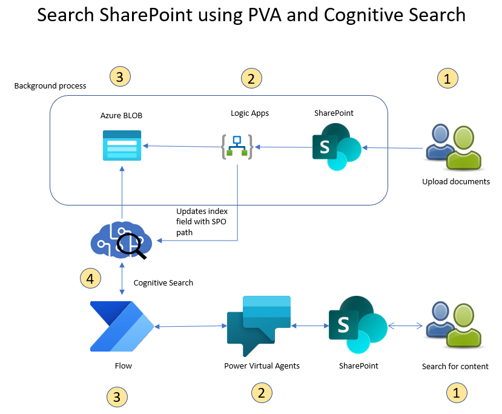

# Search SharePoint files (documents, images, audio and video files) - PVA and SharePoint Extensions (SPFX)

## Constraints
At the time of developing this, the Cognitive Search for SharePoint was in Preview and needed approval process. Till that becomes GA, we can use this methodology.

This solution works both in Azure Commercial and Azure Gov.

## Architecture

## Pre-Requisites

### User
1. The user must be admin and have Power Platform license, Power Virtual Agent license, Power Automate, and SharePoint

### Azure
1. The user must have Azure account to create azure resources shown in the diagram

### Power Platform
1. The user must have Power Virtual Agent and Power Apps License

### SharePoint
1. Need to be an admin on SharePoint
2. Site needs to be enabled for App Catalog (to upload the SharePoint Extension)
   1. It is recommended to upload the extension to individual sites as default
   2. Please refer to this [script](/PowerShell%20Scripts/Add_Site_AppCatalog.ps1) on how to enable App Catalog

### Software
1. `node.js` (specific version - 14.15.0)
2. VS Code
2. Visual Studio 2022
4. .NET 6
5. [SPFx Extension](https://github.com/pankajsurti/dl-bot-app-customizer)

## Flow
There are 2 parts to this flow. This solution supports uploading and searching within documents, images, audio, and video files.

### Part 1 - Upload file(s)

1. Go to SharePoint site and upload a file (document or image or audio or video) to a document folder
2. A logic is triggerred and retrieves the file contents
   1. For audio and video files, the Logic App puts the content in a separate audiovideo storage container, calls Video Indexers, get the transcribed text and puts them in the main document container
   2. For documents and images, the logic App puts the content in a document container
3. Then kicks of another Logic App, passing the file name and SharePoint path. This logic app will update the Cognitive Search Index with these parameters
   1. This is done so that when the user searches within a file,a  url of the location of the file is returned and the user can click on it
4. This completes the file upload process

### Part 2 - Search file(s)
1. The user asks the bot to search for a string
2. The bot calls Power Automate with the parameters
3. The Power Automate calls Cognitive Search with search parameters
   1. The Cognitive Search results are formatted into a MarkDown format and returned to the bot
4. The bot displays the result with clickable links to open the file that contains search string

## Setup

### Power Apps Solution
1. Download the zip file from [PowerApps](/PowerApps) folder
2. Follow instructions [here](https://learn.microsoft.com/en-us/power-apps/maker/data-platform/import-update-export-solutions) to have it imported to your environment
   

### Setup PVA in SharePoint

Setup Dev environment for [SPFX development](https://learn.microsoft.com/en-us/sharepoint/dev/spfx/set-up-your-development-environment)

#### Create SPFX for PVA

1. Go to Power Virtual agent and get the Direct line token
   1. In PVA studio, click on `Manage\Security\Web channel Security` 
   2. Copy the value of Key 1. This is your direct link token
2. Clone the [repo](https://github.com/pankajsurti/dl-bot-app-customizer)
3. Open the folder in VS Code
4. Open `Sharepoint\assets\ClientSideInstance.xml`
5. Edit the values in Line 7
   1. Replace `Sample Bot` with your bot name
   2. Replace `TODO-ADD-DL-SECRET` with the key gotten from step 1.
6. Repeat step 5 for the file `elements.xml` 
7. Now run 
   1. `npm-install`
   2. `gulp bundle --ship`
   3. `gulp package-solution --ship`
8. This will create a `.sspkg file` in the folder.

#### Deploy the SPFX in SharePoint

1. Follow the instructions here to [upload the package](https://learn.microsoft.com/en-us/sharepoint/use-app-catalog) in to SharePoint App Catalog

## Storage Maintanenace
Since the files are copied to a storage account, the files are kept along with the files in SharePoint as the Cognitive Search is against Storage account. For audio/video files, that is not needed. So Lifecycle Management (ALM) is set on the container that has the copied audio / video files.

## References
1. [Knowledge mining using Cognitive Search](https://learn.microsoft.com/en-us/samples/azure-samples/azure-search-knowledge-mining/azure-search-knowledge-mining/)
2. [Adding custom fields to Search Index for click through experience](https://techcommunity.microsoft.com/t5/ai-customer-engineering-team/mine-knowledge-from-audio-files-with-microsoft-ai/ba-p/781957)
3. [Logic Apps Connector for Video Indexer](https://learn.microsoft.com/en-us/azure/azure-video-indexer/logic-apps-connector-arm-accounts)

## Credits

The credit for having a PVA in SharePoint goes to the author of the below blog, without whose help this solution would not have been possible.

1. [How to add PVA to SharePoint](https://pankajsurti.com/2022/02/03/how-to-add-power-virtual-agent-pva-bot-to-a-sharepoint-page/)
2. [SPFx Extension](https://github.com/pankajsurti/dl-bot-app-customizer)