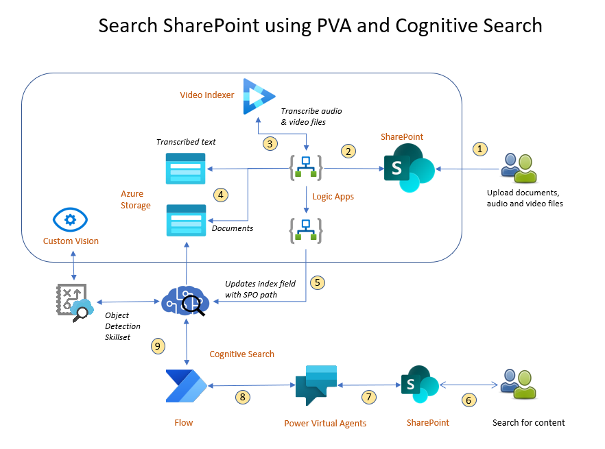

# Search SharePoint using PVA and SharePoint Extensions (SPFX)

## Constraints
At the time of developing this, the Cognitive Search for SharePoint was in Preview and needed approval process. Till that becomes GA, we can use this methodology.

This solution works both in Azure Commercial and Azure Gov.

## Architecture

## Pre-Requisites

### User Requirements
1. The user must be admin and have Power Platform license, Power Virtual Agent license, Power Automate, and SharePoint

### SharePoint Requirements
1. Need to be an admin on SharePoint
2. Site needs to be enabled for App Catalog (to upload the SharePoint Extension)
   1. It is recommended to upload the extension to individual sites as default
   2. Please refer to this [script](/PowerShellScript/Add_Site_AppCatalog.ps1) on how to enable App Catalog

### Software Requirements
1. `node.js` (specific version - 14.15.0)
2. VS Code
2. Visual Studio 2022
4. .NET 6
5. [SPFx Extension](https://github.com/pankajsurti/dl-bot-app-customizer)

## Credits

The credit for having a PVA in SharePoint goes to the author of the below blog, without whose help this solution would not have been possible.

1. [How to add PVA to SharePoint](https://pankajsurti.com/2022/02/03/how-to-add-power-virtual-agent-pva-bot-to-a-sharepoint-page/)
2. [SPFx Extension](https://github.com/pankajsurti/dl-bot-app-customizer)